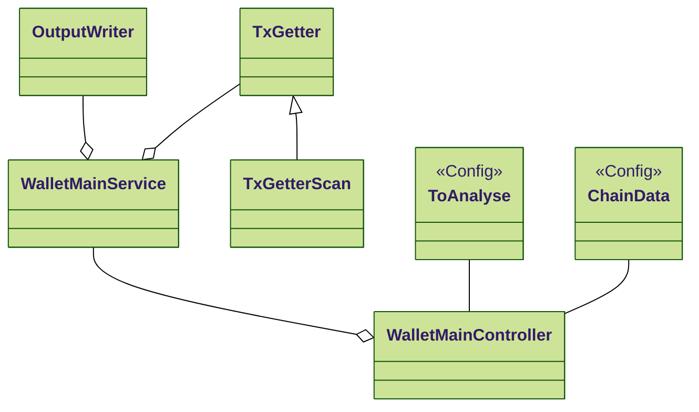

```mermaid
%%{init: {'theme': 'forest'} }%%
classDiagram
      OutputWriter --o WalletMainService
      WalletMainService --o WalletMainController
      TxGetter --o WalletMainService
      TxGetter <|-- TxGetterScan
      ToAnalyse -- WalletMainController
      ChainData -- WalletMainController
      class ToAnalyse {
        <<Config>>
      }
      class ChainData {
        <<Config>>
      }
```
