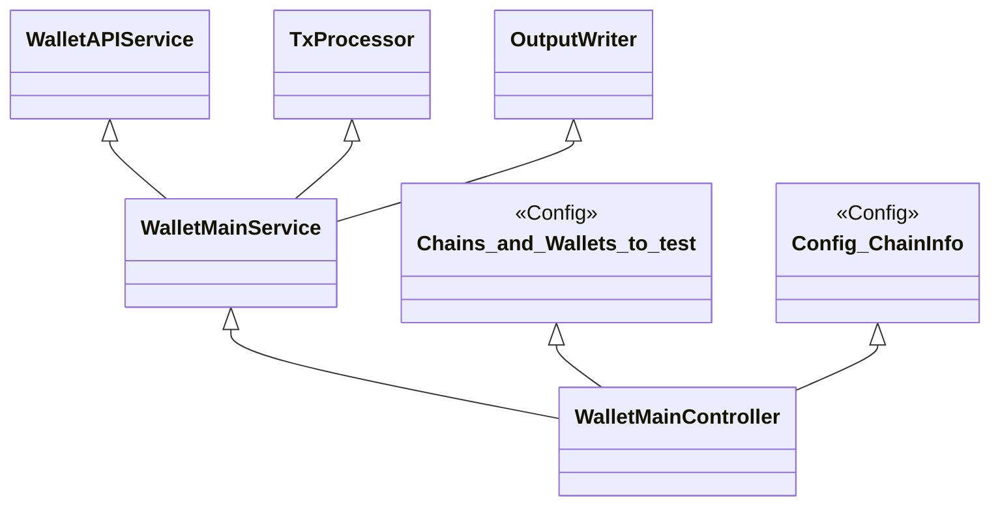

```mermaid
classDiagram
      WalletMainService <|-- WalletMainController
      WalletAPIService <|-- WalletMainService
      TxProcessor <|-- WalletMainService
      OutputWriter <|-- WalletMainService
      Chains_and_Wallets_to_test <|-- WalletMainController
      Config_ChainInfo <|-- WalletMainController
      class Chains_and_Wallets_to_test {
        <<Config>>
      }
      class Config_ChainInfo {
        <<Config>>
      }
```
